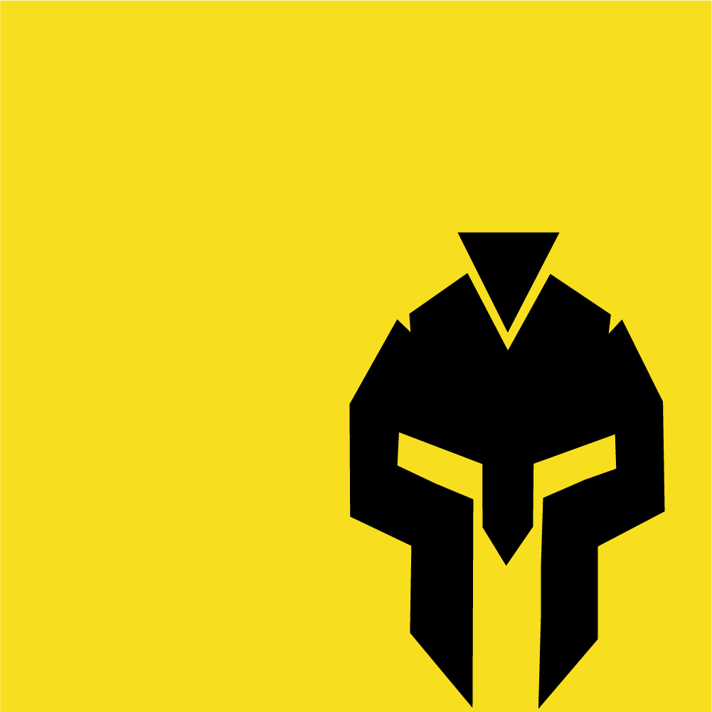

# Ambitne i wymagające zadania z JS i React

## Druga część zbioru zadań z serii "Gladiator Javascriptu"

## Aktualnie rozwijane sekcje w tym zbiorze:
- JS
  - Array
  - Object
  - Patterns
  - Promise
  - Other
- React
  - Components
  - Context
  - HOC
  - Hooks
  - Router
- Tests
- Projects

## Hej, miło Cię poznać!

### Gratuluję podjęcia dobrej decyzji i kupienia tego zbioru :) 

Będziesz mieć okazję przećwiczenia sobie Javascript z Reactem, w taki sposób w jaki jeszcze nigdy nie kodowałeś, dla kogoś na starcie drogi w IT ten zbioru to <u>wiele godzin ciężkiego myślenia i kodowania</u>

bardzo dużo ciekawych zadań przed Tobą :)

#### Starałem się wszystkie zadania opisać w sposób łatwo zrozumiały, ale jeśli czegoś nie rozumiesz - <u>napisz wiadomość na fanpage</u>, a postaram się wyjaśnić. Jestem

Ale to, że coś nie jest zrozumiałe dla Ciebie, nie zawsze oznacza, że to jest źle napisane. Czasem to Ty czegoś nie wiesz i powinieneś się douczyć

# Powodzenia :) 
 

Przemocny

Jeśli po skończeniu zadać, będziesz chciał dowiedzieć się jak Ci poszło i umówić się na omówienie z mentorem - <u>napisz wiadomość na fanpage</u>

##### stronka: https://academy.localhost-group.com/
##### fb: https://www.facebook.com/localhost40310
##### email: contact@localhost-group.com